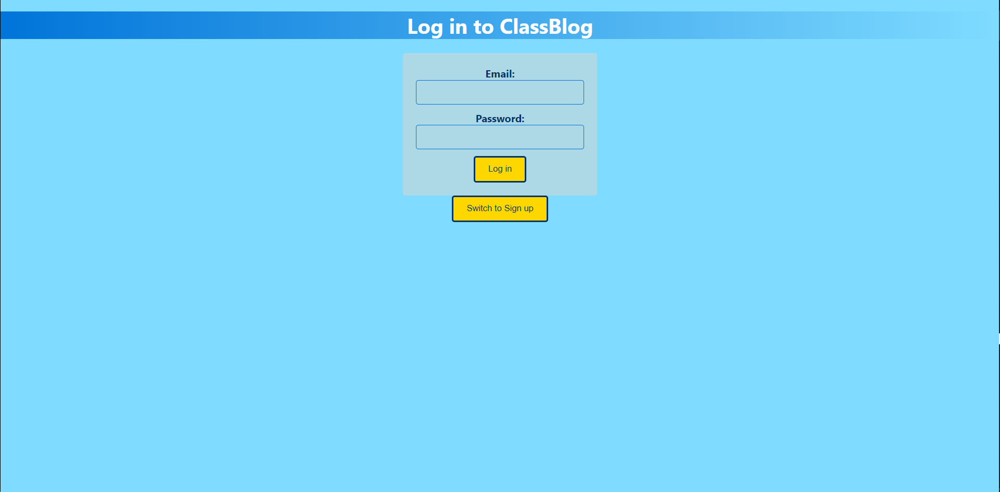
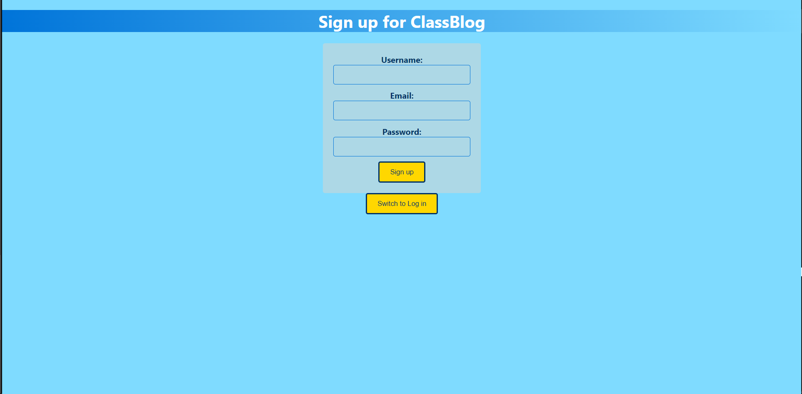
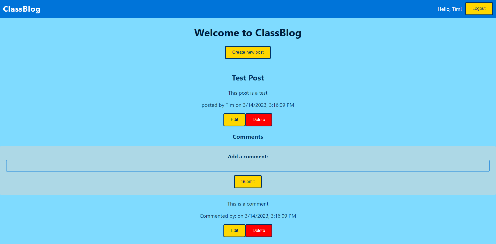
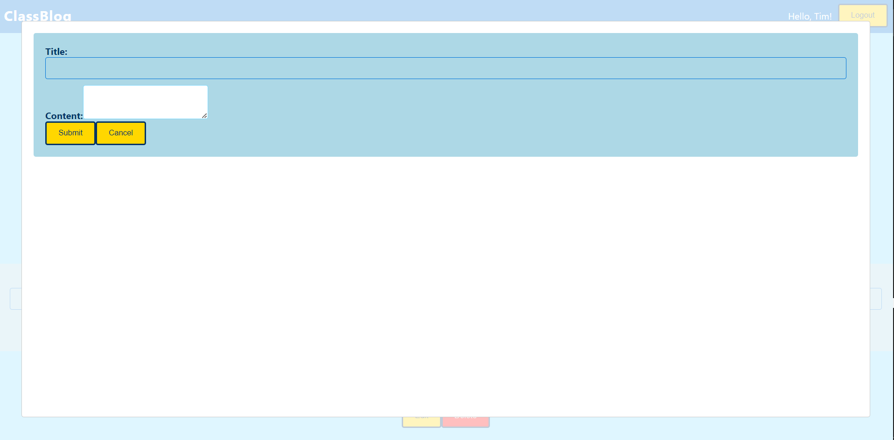

# ClassBlog
ClassBlog is an application designed to be used in the classroom as an alternative to social media.  ClassBlog allows social interaction between teachers and students in a class, without the dangers associated with the broader internet.
## Screenshots
Landing Page:

Signup Page: 

Home Page:

New Post Modal:

## Technologies Used:
- HTML
- CSS
- Javascript
- Node.js
- React.js
## Getting Started
[check out ClassBlog at this link](https://classblog.onrender.com/)

Trello Board used for planning: [here](https://trello.com/b/cbns98ga/project-4)
## Icebox/Future plans
- In its current state, ClassBlog allows all users to create and delete posts and comments.  In the future however, I want to create separate Teacher and Student accounts with different permission levels.
### user stories for V2:
- As a teacher, I want to be able to delete students' comments, so that I can remove inappropriate messges.
- As a student, I shouldn't be able to create posts, only comments.
- As a user, I want to only be able to interact with posts and comments that I personally created.
- As a teacher, I want to be able to see how many views and comments each post has received, so I can gauge student participation
- As a user, I want to be able to like comments, so that I can show approval for comments I like.
- As a student, I want to be able to like posts, so that I can share my engagement.
### user stories for V3:
- As a student, I want to be able to make posts for my teacher and classmates to see, so that I can contribute to class.
- As a teacher, I want to be able to approve/deny all student posts before they appear, so I can keep the ClassBlog organized and on topic.
- As a teacher, I want to be able to create new student accounts, so I can streamline the process of integrating the app into my classroom.
- As a user, I want to be able to reply to comments in threads, so that my conversations are better organized.